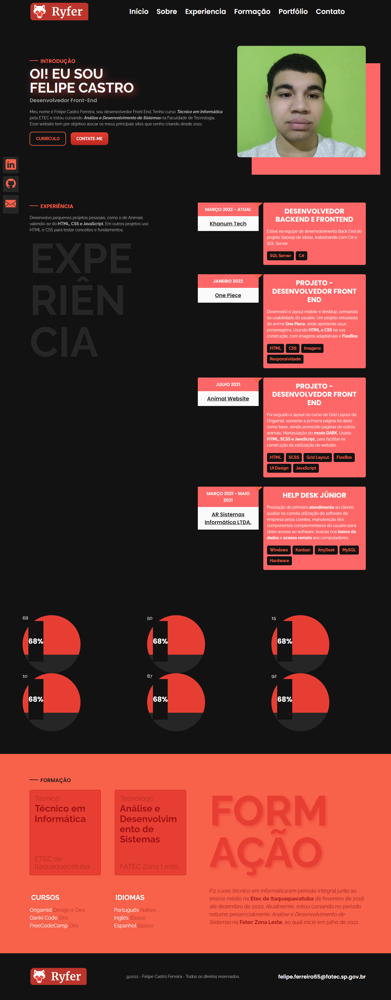

<h1 align="center"> Portfolio - Felipe Castro Ferreira </h1>

 My portfolio as a Junior Front End Developer, my experiences, my achievements and my learnings presented on a Landing Page  

> Status: Developing

  <a href="#-technologies">Technologies</a>&nbsp;&nbsp;&nbsp;|&nbsp;&nbsp;&nbsp;
  <a href="#-project">Project</a>&nbsp;&nbsp;&nbsp;|&nbsp;&nbsp;&nbsp;
  <!-- <a href="#-features">Features</a>&nbsp;&nbsp;&nbsp;|&nbsp;&nbsp;&nbsp; -->
  <a href="#-layout">Layout</a>&nbsp;&nbsp;&nbsp;|&nbsp;&nbsp;&nbsp;
  <a href="#memo-license">License</a>

 

  

## 🚀 Technologies
This project was developed with the following technologies:

<table>
 <tr>
  <td>HTML</td>
  <td>CSS</td>
  <td>Git</td>
  <td>GitHub</td>
  <td>Figma</td>
 </tr>

 <tr>
  <td>5</td>
  <td>3</td>
  <td>2.41.0.windows.3</td>
  <td>Online</td>
  <td>116.13.3</td>
 </tr>
</table>

## 💻 Project

This portfolio aims to showcase my development and experience in web development.

- [Visit the project online](https://FelipeCastro2021.github.io/Portfolio_FelipeCastro2022)

<!--
## 🪨 Features

+ Return to top of page
+ See the more recently movement created, using Cookie 
+ Entire verification system to validate forms with personalized messages. 
+ Message Of success create a movement, using Session Flash.

-->

## 🔖 Layout

You can view the project layout through [THIS LINK](https://www.figma.com/file/f8HTnQ6w78FNMIYLZtiOLV/Portf%C3%B3lio?node-id=7%3A3&t=7NTqocUjp70egM2N-0). You must have an account on [Figma](https://figma.com) to access it.

## :memo: License

This project is under the MIT license.

---

Made by Felipe Castro in 2022
